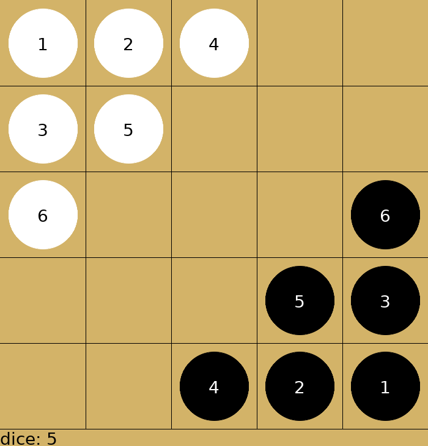

# ewn-gym

EinStein würfelt nicht for gymnasium



## How to train an Stable-baseline-3 model ?

setup the environment

```shell
git clone https://github.com/jchen8tw/ewn-gym
cd ewn-gym
pip install -r requirements.txt
```

```shell
python train.py -op [opponent policy] {A2C,PPO}
# For more options
python train.py -h
```

## How to evaluate an SB3 model

```shell
python eval_A2C.py --opponent_policy [path to model or policy name] --model [path to your model]
```

## How to train an Alpha Zero agent

```shell
conda install pytorch torchvision torchaudio pytorch-cuda=12.1 -c pytorch -c nvidia
git clone https://github.com/jchen8tw/alpha-zero-general
cd alpha-zero-general
pip install -r requirements.txt
python main_ewn.py
```

## How to eval all policies

Move your alpha zero models for `temp` into `alpha_zero_models` folder with corresponding board_size(e.g `5x5`, `7x7` .. etc) or pull it from the huggingface repo using git submodule.

```shell
cd alpha_zero_models
git submodule init
git submodule update
```

Now you can eval all policies except for the stable-baseline-3 policy(we've abandoned it for lack performance) .

```shell
python eval_pairs.py
```
